<!-- Slide 1: Title -->
<!-- _class: lead -->

# Enforcing Engineering Discipline with AI

## The Lifecycle Hasn't Changed. Now It's Enforceable.

<div style="display: flex; align-items: center; justify-content: space-between; margin-top: 0.5em;">
<div>

**Alex Djalali**
Research Faculty, Georgia Tech
Former Software Architect & Principal Engineer (Salesforce & Tableau)

<div style="display: flex; gap: 1.5em; align-items: center; margin-top: 0.5em;">


</div>

</div>

</div>

<!-- Speaker notes:
Introduce yourself briefly. Research faculty at Georgia Tech, background in NLP and distributed systems. Today's talk: how AI fits into the engineering lifecycle you already believe in — not as a replacement for judgment, but as the mechanism that enforces the discipline you've always practiced.
-->

---

<!-- Slide 2: The Lifecycle Hasn't Changed -->

# The Software Engineering Lifecycle

Every rigorous engineering team follows the same phases:

**Architecture** → **Design** → **Plan** → **Implement** → **Test** → **Verify** → **Ship**

<div class="highlight-box">

The question isn't whether this lifecycle matters. It's whether we actually follow it — every time, under pressure, at speed.

</div>

<!-- Speaker notes:
Start with common ground. Everyone in this room believes in this lifecycle. The challenge has never been knowing the right process — it's been consistently following it. Under deadline pressure, corners get cut. Architecture decisions get made implicitly. Tests get written "later." The lifecycle is aspirational for most teams most of the time.
-->

---

<!-- Slide 3: The Risk — Vibe Coding -->

# The Risk: Vibe Coding

<div class="two-col">
<div>

### Skipped Lifecycle

- "Build me an app" → ship it
- Architecture? AI decided.
- Design? Skipped.
- Tests? Maybe later.
- Review? "It works."
- **Tech debt at machine speed**

</div>
<div>

### Enforced Lifecycle

- Architecture → human decision
- Design → human decomposition
- Plan → human approval
- Implement → TDD, AI executes
- Verify → gates, non-negotiable
- **Leverage at machine speed**

</div>
</div>

AI makes it trivially easy to skip every phase. That's the risk — not that AI writes bad code, but that it lets you bypass the process that catches bad decisions.

<!-- Speaker notes:
The danger of vibe coding isn't bad syntax. AI syntax is fine. The danger is skipping the decisions that matter — architecture, decomposition, test strategy. When you let a model choose your architecture and error handling, you haven't saved time. You've accumulated technical debt at machine speed. You just don't know it yet because the code compiles.
-->

---

<!-- Slide 4: The Thesis -->

# The Thesis

<div class="highlight-box">

AI doesn't replace the engineering lifecycle. It **enforces** it.

Your rigor, encoded and automated.

</div>

- You already know what good engineering looks like
- The problem was never knowledge — it was **consistency**
- AI is the mechanism that makes your standards **non-negotiable**

> "The source of leverage isn't the AI. It's the constraints you put around it."

<!-- Speaker notes:
This is the core claim. AI doesn't lower the bar. It encodes the bar you already believe in and enforces it mechanically, every time, without fatigue or deadline pressure. The engineers who benefit most from AI aren't the ones who prompt hardest — they're the ones who have written down what "good" looks like and refuse to accept anything less.
-->

---

<!-- Slide 5: Decide — Architecture, Design & Planning -->

# Decide: Architecture, Design & Planning

**The lifecycle starts with decisions, not code.**

- **Architecture**: ADRs capture the _why_. AI explores and proposes — **humans decide and own.**
- **Design**: Epics decomposed into stories with clear scope. AI identifies sub-tasks — **humans set boundaries.**
- **Planning**: AI reads the codebase, proposes concrete tasks. **No code until a human approves the plan.**

<div class="highlight-box">

**Principle:** Judgment stays with the engineer. AI accelerates exploration, not decision-making.

</div>

The traceability chain starts here — every PR links back to the ADR and plan that motivated it.

<!-- Speaker notes:
These three phases — architecture, design, planning — are where human judgment matters most and where corners get cut under pressure. AI makes each one easier, not harder. It can explore a codebase, draft an ADR, decompose an epic, and propose a plan in minutes. But the decisions — which approach, which tradeoffs, what's in scope — those are yours. The plan approval gate is critical: the developer explicitly says "proceed" before any code is written. This is the separation of judgment from execution in practice.
-->

---

<!-- Slide 6: Build — Implementation & TDD -->

# Build: Implementation & TDD

**TDD — failing test first. Always.**

1. **Red** — Write a failing test that encodes the requirement
2. **Green** — Write the minimum code to pass
3. **Refactor** — Clean up while tests stay green

AI-generated code is a **statistical approximation** of what you asked for.
Tests are **encoded invariants** — they don't approximate, they assert.

<div class="two-col">
<div>

### Without TDD

- AI writes plausible code
- Bugs hide in edge cases
- Refactoring is risky

</div>
<div>

### With TDD

- Test encodes the requirement
- Edge cases tested explicitly
- Refactoring is safe

</div>
</div>

<!-- Speaker notes:
TDD isn't optional in this workflow. The failing test is the specification — it encodes what the code is supposed to do. AI writes the test first, then the implementation, then refactors. This matters because AI-generated code is a statistical approximation. The test is the invariant that tells you whether the approximation is correct. Without it, you're trusting a statistical approximation. With it, you're verifying against an encoded invariant. Tests bridge the gap between human intent and AI output.
-->

---

<!-- Slide 7: Ship — Verification & Delivery -->

# Ship: Verification & Delivery

**Four gates before every commit. No exceptions.**

| Gate           | What it catches                   | Auto-fixable? |
| -------------- | --------------------------------- | ------------- |
| **Format**     | Style inconsistencies             | Yes           |
| **Lint**       | Code smells, anti-patterns        | Mostly        |
| **Type Check** | Type errors, interface mismatches | No — AI fixes |
| **Tests**      | Behavioral regressions            | No — AI fixes |

**Same bar regardless of who wrote the code.** Human or AI — the gates don't care.

Then: conventional commits, PRs that link to the plan, traceability from **Decision → Epic → Story → Plan → PR**.

<!-- Speaker notes:
This is what "non-negotiable" means in practice. The same quality bar applies whether the code was written by hand, by a junior dev, or by AI. Format and lint auto-fix. Type check and tests require the AI to fix and retry. The commit is blocked until all four pass. No exceptions. Then delivery closes the loop: conventional commits make the log readable, and PRs link back through the full traceability chain. Six months later, the archaeology is trivial.
-->

---

<!-- Slide 8: The Full Lifecycle -->

# The Full Lifecycle



Every phase connected. The **verify → implement** feedback loop is the key — failures don't end the process, they feed back into it.

Enter anywhere: small feature → plan directly. Structural change → start at architecture.

<!-- Speaker notes:
This is the full pipeline. Note the feedback loop from verification back to implementation — failures become new tasks, not blockers. Most features verify on the first pass. Complex changes sometimes take 2-3 iterations. The system handles both. Also note: you enter wherever makes sense. Not everything needs an ADR. A small bug fix can start at planning. The lifecycle is a directed graph, not a rigid waterfall.
-->

---

<!-- Slide 10: Encoding Your Standards -->

# Encoding Your Standards

The mechanism is simple: **write your standards in a file AI can read.**

```
~/.claude/CLAUDE.md        → Standards for Claude Code
~/.cursor/rules            → Standards for Cursor
project/.claude/settings   → Project-specific overrides
```

One file. Readable by any AI tool. Contains:

- Language conventions, naming patterns
- Architecture rules, dependency constraints
- Quality thresholds, anti-patterns to avoid

> "Structure beats intelligence."

<!-- Speaker notes:
This is the most generalizable takeaway. You don't need a custom system. You need a file that describes what "good" looks like in your codebase. Language conventions, architecture rules, quality thresholds. Put it where the AI reads it. The same file works across different AI tools — because the leverage is in the standards, not the tool.
-->

---

<!-- Slide 11: Reference Code — Solving the Cold Start -->

# Reference Code: Solving the Cold Start

**Rules tell AI what to do. Reference code shows it _how_.**

The 0→1 problem is real: on a greenfield project, AI has no patterns to follow. The fix:

- **Pull in gold-standard repos** — your own past projects that represent how you build
- **Curate third-party examples** — open-source code with patterns worth following
- **Seed the codebase** — a small, well-structured module gives AI a template to extrapolate from

<div class="highlight-box">

**Standards + reference code = a codebase that teaches.** AI doesn't just follow rules — it pattern-matches against examples. Give it good ones.

</div>

One clean module is worth a thousand lines of documentation.

<!-- Speaker notes:
This is the practical complement to the standards file. Standards are rules — "use early returns," "repository pattern for data access." Reference code is examples — here's what that actually looks like in our stack. The cold start problem is real. On a brand new project, AI has nothing to pattern-match against and the output is generic. The fix is simple: pull in a repo that represents how you build, or seed the project with one well-structured module. AI extrapolates from examples far better than it interprets abstract rules. The combination — standards for constraints, reference code for patterns — is what produces consistent, high-quality output from day one.
-->

---

<!-- Slide 12: AI Amplifies What's Already There -->

# AI Amplifies What's Already There

<div class="two-col">
<div>

### Good Discipline + AI

- Explicit architecture → consistent codebase
- TDD → reliable implementations
- Quality gates → no regression
- Clear standards → reproducible output
- **Leverage at scale**

</div>
<div>

### Bad Discipline + AI

- No architecture → inconsistent mess _faster_
- No tests → confident bugs
- No gates → tech debt at machine speed
- Vague standards → random output
- **Liability at scale**

</div>
</div>

> "You play like you practice."

AI doesn't fix a broken process. It accelerates whatever process you already have.

<!-- Speaker notes:
This is the slide for skeptics. AI is an amplifier, not a corrective. If your engineering culture is disciplined, AI makes it faster. If it's sloppy, AI makes it sloppier — at machine speed. The question for every team isn't "should we use AI?" It's "do we have the discipline to use it well?" If the answer is no, fix the discipline first. Then the AI becomes leverage instead of liability.
-->

---

<!-- Slide 13: Actionable Takeaways -->

# Actionable Takeaways

### What you can do Monday morning:

**1. Write your standards down.** If they only live in people's heads, AI can't follow them.

**2. Seed with reference code.** One gold-standard module teaches AI more than a page of rules.

**3. Pick one quality gate** and make it non-negotiable. Start with formatting.

**4. Enforce TDD.** AI-generated code needs tests _more_, not less.

**5. Separate judgment from execution.** Humans approve plans. AI implements them.

<div class="highlight-box">

One standards file + one reference module. That's the minimum. What took an afternoon is now **20 minutes** — but only if the discipline is there first.

</div>

<!-- Speaker notes:
Make this practical. Everyone should leave with something they can do immediately. Items 1 and 2 are the minimum viable version — write down what "good" looks like, and give AI an example of what it looks like in practice. The rest follows naturally. The speed stat is real — 400 lines of well-structured, well-tested implementation in 20 minutes — but only because the standards, reference code, and gates were already in place.
-->

---

<!-- Slide 14: Close -->
<!-- _class: lead -->

# The Lifecycle Hasn't Changed.

# AI Just Makes It Enforceable.

**Dotfiles:** [github.com/alexdjalali/dotfiles](https://github.com/alexdjalali/dotfiles)
`.claude/CLAUDE.md` · `standards/` · `templates/` · `commands/`

_Questions?_

<!-- Speaker notes:
Close with the thesis restated. The lifecycle hasn't changed — it's the same phases we've always agreed on. AI is the mechanism that makes it enforceable, consistently, without fatigue or shortcuts. The discipline is yours. The enforcement is automated. Point people to the blog and course for deeper dives. Open for questions.
-->
